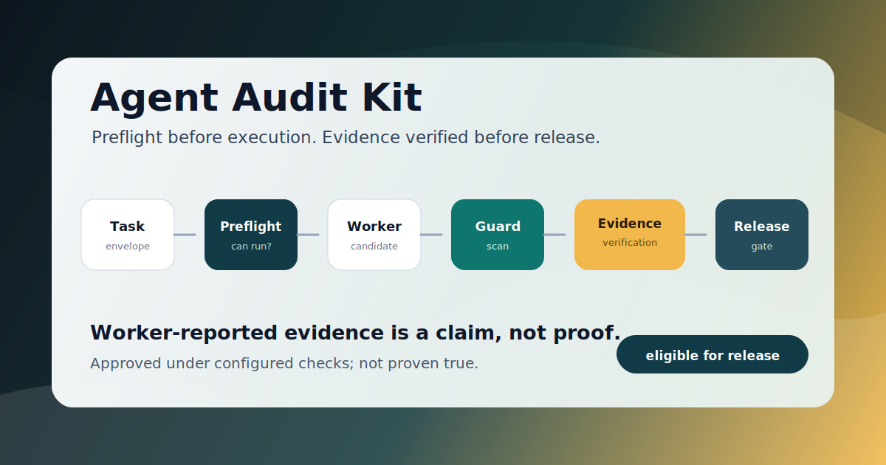

<p align="center">
  
</p>

# Agent Audit Kit

**Stop trusting agent output. Start auditing it.**

Agent Audit Kit is a small, practical safety layer for AI agents, vibe-coded workers, and automation scripts. It separates pre-execution permission checks from post-execution output audit, so an agent result stays a **candidate** until it passes the configured gate.


> Worker-reported evidence is a claim, not proof.

> `approved_candidate` means approved under the configured checks; not proven true.

## Why This Exists

Many AI workflows fail in quiet ways:

- A worker claims it finished, but no verified checks exist.
- A report looks confident, but only cites sources the worker claimed.
- A script prints an API key into a log or markdown file.
- An agent asks for a tool it should not have.
- A generated patch is treated as safe before anyone audits it.

Agent Audit Kit gives builders a simple pattern for catching those failures before they reach a user, a commit, a production system, or an external action.

## The Pattern

```text
Task envelope
    |
    v
Preflight
    |
    v
Worker executes
    |
    v
Output guard
    |
    v
Evidence verification
    |
    v
Release gate
    |
    v
approved_candidate | needs_review | blocked_candidate
```

The trust boundary is important: preflight happens before worker execution. Output audit happens after worker execution.

## Quick Start

```bash
python -m venv .venv
. .venv/bin/activate
pip install -e ".[dev]"
pytest
```

```python
from agent_audit_kit import CandidateOutput, PreflightPolicy, run_guarded_task

policy = PreflightPolicy(
    allowed_tools=("filesystem_read",),
    forbidden_tools=("network", "browser"),
    allowed_actions=("draft_response",),
    blocked_actions=("read_secret", "print_secret"),
)

envelope = {
    "requested_tools": ["filesystem_read"],
    "requested_actions": ["draft_response"],
    "network_access": False,
}


def worker(_envelope):
    return CandidateOutput(
        content="Draft response created.",
        evidence={"sources": ["worker-log"], "checks_run": ["draft-created"]},
    )


def verifier(_candidate):
    return {
        "sources": ["test-log"],
        "checks_run": ["manual-smoke-test"],
        "artifacts": ["logs/smoke-test.txt"],
        "verifier": "external-reviewer",
    }


result = run_guarded_task(envelope, policy, worker, verifier=verifier)

print(result.status)
# approved_candidate
```

## Preflight Before Worker Execution

Use `preflight_task()` when you want to check whether a task may run.

```python
from agent_audit_kit import PreflightPolicy, preflight_task

preflight = preflight_task(envelope, policy)

if not preflight.can_execute:
    print(preflight.status)
    print(preflight.explanations)
    raise SystemExit("Worker must not run.")
```

`audit_candidate()` still accepts `envelope` and `policy` for retrospective compatibility, but that is not a substitute for pre-execution preflight.

## Claimed Evidence vs Verified Evidence

`CandidateOutput.evidence` is claimed evidence. It is useful, but it is not proof.

```python
candidate = CandidateOutput(
    content="Worker says tests passed.",
    evidence={"sources": ["worker"], "checks_run": ["pytest"]},
)

result = audit_candidate(candidate)
print(result.status)
# needs_review
```

To become eligible for release, provide independently verified evidence:

```python
result = audit_candidate(
    candidate,
    verified_evidence={
        "sources": ["ci-log"],
        "checks_run": ["pytest"],
        "artifacts": ["ci/pytest.log"],
        "verifier": "ci",
    },
)

print(result.eligible_for_release)
# True
```

Verified evidence must come from a deterministic check, a human reviewer, or an independent system that leaves an inspectable artifact. An LLM saying "looks correct" is not verification. If an LLM participates, it must be a different principal than the worker and attach a machine-checkable artifact such as a diff, test log, or review record.

## Configuration and Custom Guards

Use `AuditConfig` and custom guards when your agent has domain-specific rules.

```python
from agent_audit_kit import AuditConfig, CandidateOutput, Finding, audit_candidate


def citation_guard(output: CandidateOutput):
    if "according to" in output.content.lower() and not output.evidence.get("sources"):
        return Finding(
            kind="citation_needed",
            message="This claim needs a source before release.",
            severity="medium",
        )
    return None


result = audit_candidate(
    CandidateOutput(content="According to the policy, this is allowed."),
    config=AuditConfig(custom_guards=(citation_guard,)),
)

print(result.status)
# needs_review
```

See [docs/EXTENDING.md](docs/EXTENDING.md).

## Async Use

```python
from agent_audit_kit import CandidateOutput, run_guarded_task_async

async def worker(_envelope):
    return CandidateOutput(
        content="Async worker produced a candidate.",
        evidence={"sources": ["worker-log"], "checks_run": ["draft-created"]},
    )

result = await run_guarded_task_async(envelope, policy, worker, verifier=verifier)
```

## Secret Leak Example

```python
from agent_audit_kit import CandidateOutput, audit_candidate

fake_key = "sk-proj-" + "abcdefghijklmnopqrstuvwxyz1234567890"

result = audit_candidate(
    CandidateOutput(
        content="OPENAI_API_KEY=" + fake_key,
        evidence={"sources": ["unit-test"], "checks_run": ["secret-scan"]},
    ),
    verified_evidence={
        "sources": ["unit-test"],
        "checks_run": ["secret-scan"],
        "artifacts": ["synthetic-test"],
        "verifier": "unit-test",
    },
)

print(result.status)
# blocked_candidate

print(result.output.content)
# OPENAI_API_KEY=<redacted>
```

Secret scanning is pattern-based: it catches known key formats only, and a pass is not a guarantee that no secret exists. It does not replace secret managers, pre-commit scanners, or repository-history cleanup.

Redaction in the candidate output does not un-leak anything already written to logs, disk, screenshots, or git history.

## What It Checks

- **Preflight**: may the task run before the worker executes?
- **Guard**: does output contain secret-like material?
- **Claimed evidence**: what did the worker or caller claim?
- **Verified evidence**: what did an external verifier confirm?
- **Release gate**: should the candidate be released, reviewed, or blocked?

Every non-passing result includes explainable findings:

```python
for explanation in result.explanations:
    print(explanation)
```

## What This Does Not Prove

Agent Audit Kit:

- does not prove output is factually true;
- does not replace sandboxing, IAM, access control, or secret managers;
- cannot save a credential that has already been committed to git history;
- only audits according to the checks you configure;
- does not make a workflow safe if the caller skips preflight or the release gate.

## For Non-Technical Builders

You can use the idea even before using the code:

1. Treat every AI answer as a candidate.
2. Check permission before the AI worker runs.
3. Ask what evidence the worker claims.
4. Verify that evidence outside the worker.
5. Scan for secrets before sharing or committing.
6. Put a release gate between the agent and the real world.

See [docs/NON_TECH_GUIDE.md](docs/NON_TECH_GUIDE.md).

## Feedback

The first public version is intentionally small. If you test it, the most useful feedback is whether the gate feels too strict, too loose, or confusing.

See [docs/FEEDBACK_GUIDE.md](docs/FEEDBACK_GUIDE.md).

## Examples

- [examples/basic_audit.py](examples/basic_audit.py)
- [examples/nontech_flow.py](examples/nontech_flow.py)
- [examples/pure_python_agent.py](examples/pure_python_agent.py)
- [examples/custom_guard.py](examples/custom_guard.py)
- [examples/async_audit.py](examples/async_audit.py)
- [examples/langchain_style_wrapper.py](examples/langchain_style_wrapper.py)

## Roadmap

Agent Audit Kit should stay lightweight. Useful next additions may include optional adapters for popular agent frameworks, stronger optional secret scanning, and richer human-review queues. Those should be optional layers, not required dependencies.

## Public Boundary

This repo intentionally shares only the generic audit pattern. It does not include private project architecture, credentials, prompts, memory, or logs.

See [docs/PUBLIC_BOUNDARY.md](docs/PUBLIC_BOUNDARY.md).

## Status

This is an early public kit. The goal is feedback from builders, non-technical operators, vibe coders, and agent developers who want safer AI workflows without needing a full platform.

## License

MIT
